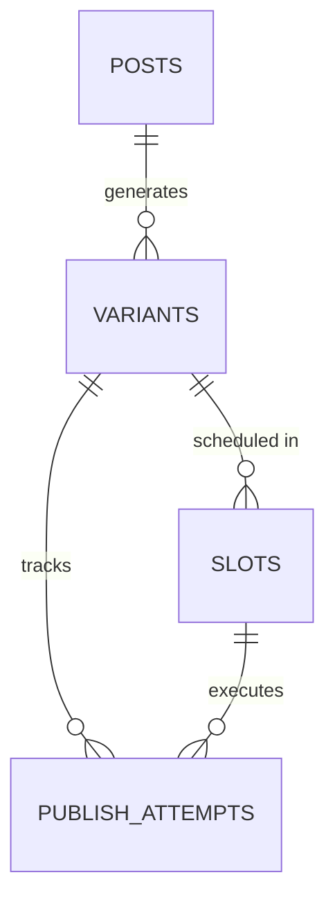

# Social Media Studio — Technical Design Document (Phase 1)

## 1. Architectural Overview

Social Media Studio is a backend service designed to ingest blog post content (URL or Markdown), generate platform-optimized variants, manage a content approval workflow, schedule publications durably, and publish posts to social destinations.

```mermaid
flowchart TD
    Client[Client Application / REST API] --> API[Express API Server]
    API --> DB[(PostgreSQL Database)]
    DB --> Jobs[(scheduled_jobs Table)]
    Worker[PublishWorker Background Daemon] --> Jobs
    Worker -->|Atomically Claims FOR UPDATE SKIP LOCKED| Jobs
    Worker --> Registry[Publisher Registry]
    Registry --> Discord[Discord Webhook Adapter (REAL Target)]
    Registry --> MockX[Mock X Adapter (MOCK)]
    Registry --> MockLinkedIn[Mock LinkedIn Adapter (MOCK)]
```

---

## 2. Platform Constraint Profiles

The application defines explicit, configurable constraint profiles for supported social media platforms to ensure generated variants fit target requirements:

| Platform Identifier | Name | Max Content Length | Tone | Max Hashtags | Markdown Support |
| :--- | :--- | :--- | :--- | :--- | :--- |
| `discord` | Discord Community Webhook | 2,000 chars | `conversational` | 3 | Yes |
| `mock_x` | Mock X (Twitter) | 280 chars | `concise` | 2 | No |
| `mock_linkedin` | Mock LinkedIn | 3,000 chars | `professional` | 5 | Yes |

### Profile Definitions (`src/config/platformConstraints.ts`)
```typescript
export interface PlatformConstraintProfile {
  platform: 'discord' | 'mock_x' | 'mock_linkedin';
  name: string;
  maxLength: number;
  tone: 'conversational' | 'concise' | 'professional';
  maxHashtags: number;
  supportsMarkdown: boolean;
}
```
Magic numbers are centralized in `src/config/platformConstraints.ts` rather than scattered through business logic.

---

## 3. SocialPublisher Interface Signature

Business logic depends strictly on a platform-independent abstraction interface. No platform-specific parameters (such as Discord webhooks or Twitter tokens) leak into domain services.

```typescript
export interface PublishInput {
  variantId: string;
  content: string;
  platform: PlatformType;
  idempotencyKey: string;
  scheduledSlotId: string;
  metadata?: Record<string, unknown>;
}

export interface PublishResult {
  success: boolean;
  platform: PlatformType;
  externalPostId?: string | null;
  publishedAt: Date;
  url?: string | null;
  error?: {
    code: string;
    message: string;
    details?: Record<string, unknown>;
  } | null;
}

export interface SocialPublisher {
  readonly platform: PlatformType;
  publish(input: PublishInput): Promise<PublishResult>;
}
```

---

## 4. Adapter Architecture & Registry Design

The system implements three publisher adapters under a clean factory/registry pattern:

```
SocialPublisher (Interface)
├── DiscordPublisher        (REAL: sends HTTP POST to configured Discord Webhook)
├── MockXPublisher           (MOCK: records in-memory publication details & returns preview URL)
└── MockLinkedInPublisher    (MOCK: records in-memory publication details & returns preview URN)
```

### Registry Resolution Pattern
```typescript
const adapterName = process.env.SOCIAL_ADAPTER || 'discord';
const publisher = publisherRegistry.getPublisher(adapterName);
```
Changing `SOCIAL_ADAPTER=discord` to `SOCIAL_ADAPTER=mock_x` swaps the implementation seamlessly without modifying business logic or conditional `if (platform === 'discord')` branching.

---

## 5. Relational Data Model (PostgreSQL)

### Entity Relationship Diagram


### Table Definitions & Idempotency Constraints

1. **`posts`**: Single source of truth for original ingested content.
   - `id`: UUID (Primary Key)
   - `source_type`: VARCHAR(20) (`url` | `markdown`)
   - `source_url`: TEXT NULL
   - `source_content`: TEXT NOT NULL
   - `title`: VARCHAR(255) NULL
   - `created_at`, `updated_at`: TIMESTAMPTZ

2. **`variants`**: Platform-adapted versions generated from stored posts.
   - `id`: UUID (Primary Key)
   - `post_id`: UUID (FK -> `posts.id`)
   - `platform`: VARCHAR(30) (`discord` | `mock_x` | `mock_linkedin`)
   - `content`: TEXT NOT NULL
   - `status`: VARCHAR(20) (`draft` | `approved` | `rejected` | `published`)
   - `validation_info`: JSONB NOT NULL
   - `created_at`, `updated_at`: TIMESTAMPTZ

3. **`slots`**: Publication schedule entries.
   - `id`: UUID (Primary Key)
   - `variant_id`: UUID (FK -> `variants.id`)
   - `scheduled_at`: TIMESTAMPTZ NOT NULL
   - `status`: VARCHAR(20) (`scheduled` | `cancelled` | `completed`)
   - `created_at`, `updated_at`: TIMESTAMPTZ

4. **`publish_attempts`**: Immutable ledger of execution attempts.
   - `id`: UUID (Primary Key)
   - `variant_id`: UUID (FK -> `variants.id`)
   - `slot_id`: UUID (FK -> `slots.id`)
   - `idempotency_key`: VARCHAR(255) UNIQUE NOT NULL
   - `status`: VARCHAR(20) (`pending` | `success` | `failed`)
   - `attempted_at`: TIMESTAMPTZ NOT NULL
   - `completed_at`: TIMESTAMPTZ NULL
   - `external_post_id`: VARCHAR(255) NULL
   - `error_info`: JSONB NULL
   - `metadata`: JSONB NULL
   - **Database Constraint**: `CONSTRAINT uq_publish_attempts_variant_slot UNIQUE (variant_id, slot_id)`

---

## 6. Content Review Workflow

Content follows a strict, non-reversible state machine:

```
[ draft ] ───(Approve)───► [ approved ] ───(Publish)───► [ published ]
    │
 (Reject)
    ▼
[ rejected ]
```

### Valid State Transitions
- `draft -> approved`
- `draft -> rejected`
- `approved -> published`

> [!IMPORTANT]
> **CRITICAL RULE**: UNAPPROVED VARIANTS MUST NEVER BE SCHEDULED.
> The scheduling endpoint (`POST /variants/:id/schedule`) explicitly rejects any variant with status `draft` or `rejected` with a `400 Bad Request` or `422 Unprocessable Entity` HTTP status.

---

## 7. API Surface Specification

### Core REST Endpoints

#### 1. `POST /posts` — Ingest Content
- **Request Body**:
```json
{
  "sourceType": "markdown",
  "sourceContent": "# Modern Backend Architecture\nBuilding resilient social publishing systems...",
  "title": "Modern Backend Architecture"
}
```
- **Response** (`201 Created`):
```json
{
  "id": "123e4567-e89b-12d3-a456-426614174000",
  "sourceType": "markdown",
  "sourceContent": "# Modern Backend Architecture...",
  "title": "Modern Backend Architecture",
  "createdAt": "2026-09-01T22:00:00.000Z"
}
```

#### 2. `GET /posts/:id` — Retrieve Source Post
- **Response** (`200 OK`): Retransmits stored post entity.

#### 3. `POST /posts/:id/variants` — Generate Platform Variants
- **Request Body**:
```json
{
  "platforms": ["discord", "mock_x", "mock_linkedin"]
}
```
- **Response** (`201 Created`): Returns array of generated `variant` objects in `draft` status.

#### 4. `GET /variants/:id` — Retrieve Variant
- **Response** (`200 OK`): Single variant details with `validation_info`.

#### 5. `POST /variants/:id/approve` — Approve Variant
- **Response** (`200 OK`): Variant status updated to `approved`.

#### 6. `POST /variants/:id/reject` — Reject Variant
- **Response** (`200 OK`): Variant status updated to `rejected`.

#### 7. `PUT /variants/:id` — Edit Variant Content
- **Request Body**: `{ "content": "Updated content..." }`
- **Response** (`200 OK`): Variant content updated and re-validated.

#### 8. `POST /variants/:id/schedule` — Schedule Approved Variant
- **Request Body**: `{ "scheduledAt": "2026-09-02T10:00:00.000Z" }`
- **Error Response** (`400 Bad Request` if variant status != `approved`):
```json
{
  "error": {
    "code": "VARIANT_NOT_APPROVED",
    "message": "Only approved variants may be scheduled for publication."
  }
}
```
- **Success Response** (`201 Created`): Returns created `slot` entity.

#### 9. `GET /variants/:id/history` — Publication History
- **Response** (`200 OK`): Returns array of `publish_attempts` for variant.

#### 10. `GET /publish-attempts/:id` — Inspect Single Attempt
- **Response** (`200 OK`): Detailed attempt record.

#### 11. `GET /health` — Health Check
- **Response** (`200 OK`): Service status & environment metadata.

---

## 8. Idempotency Strategy

Idempotency guarantees that:
$$\text{SAME VARIANT} + \text{SAME SLOT} = \text{EXACTLY ONE SUCCESSFUL PUBLICATION}$$

### 3-Layer Idempotency Hierarchy
1. **API Layer**: `Idempotency-Key` HTTP header handled by API gateway/middleware to deduplicate client retries.
2. **Database Layer (Primary Invariant)**: `UNIQUE(variant_id, slot_id)` constraint on `publish_attempts`. Any concurrent worker retry attempting to insert a duplicate attempt for the same variant and slot is aborted by PostgreSQL's unique constraint violation (`23505`).
3. **Publisher Layer**: Unique deterministic `idempotencyKey` passed into `SocialPublisher.publish(input)`.

---

## 9. Durable Scheduling Architecture

```
API Request -> DB Slot Insert -> BullMQ Job Enqueue -> Worker Dequeue -> SocialPublisher -> DB Ledger Update
```

1. **Database Source of Truth**: When scheduled, slot is saved to DB (`slots` table).
2. **Durable Queue**: BullMQ delay job created in Redis using `slot.id` as job ID.
3. **Worker Safety**: Before calling `SocialPublisher`, worker executes `INSERT INTO publish_attempts (variant_id, slot_id, status) ... ON CONFLICT DO NOTHING`. If an attempt already exists, worker skips execution.
4. **Crash Recovery**: If worker restarts mid-execution, database state prevents duplicate publication calls.

---

## 10. Security Architecture & Environment Isolation

- **Zero Hard-Coded Credentials**: Discord Webhooks stored exclusively in `.env`.
- **Git Safety**: `.env` is listed in `.gitignore`. `.env.example` contains placeholders only.
- **Sanitized Errors**: Stack traces and raw internal error details are suppressed from production HTTP responses and sanitized before DB persistence.
- **Request Validation**: All endpoint payloads validated via Zod schemas.

---

## 11. Explicit Non-Goals

1. **No Real X (Twitter) Publishing**: MockXPublisher is an in-memory test adapter.
2. **No Real LinkedIn Publishing**: MockLinkedInPublisher is an in-memory test adapter.
3. **No Image Generation**: Out-of-scope for backend capstone.
4. **No Engagement/Analytics Tracking**: Out-of-scope for backend capstone.
