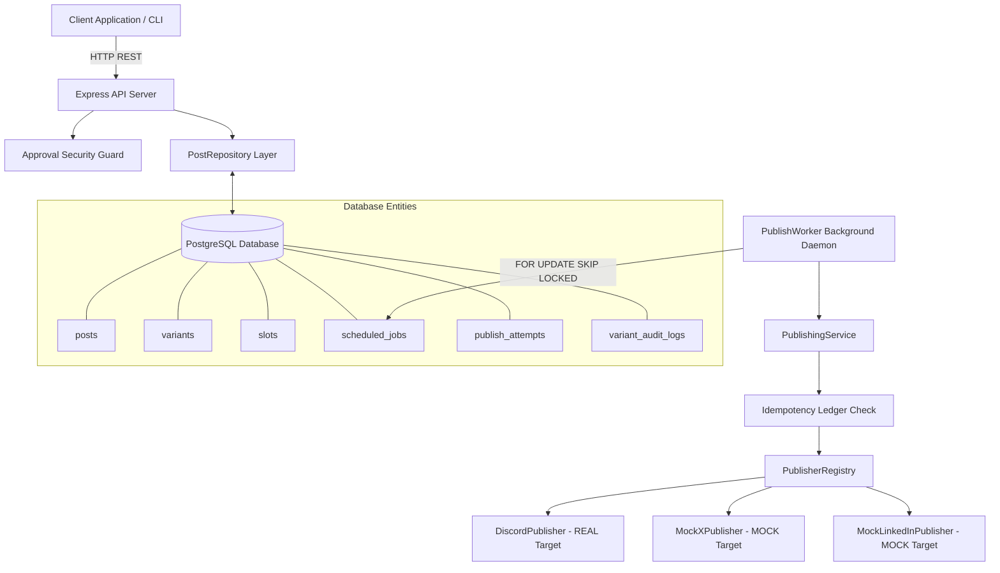
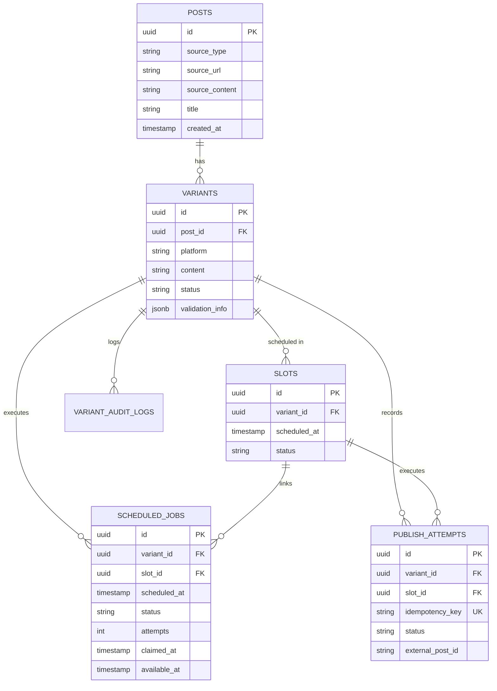
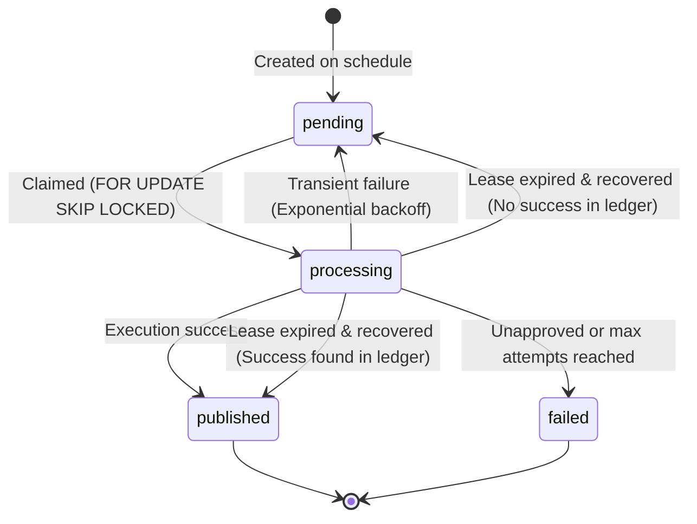
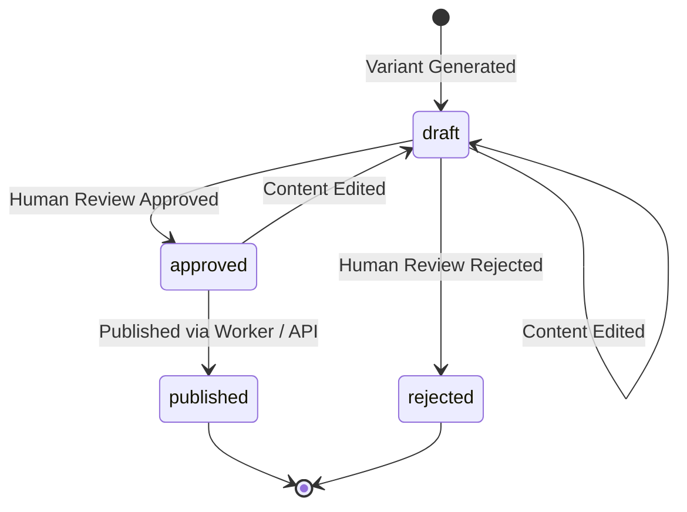

# FlyRank AI — Social Media Studio

An approval-first social publishing backend that ingests canonical content, generates platform-specific variants, requires human approval, publishes through platform adapters, and safely schedules/retries publications with PostgreSQL-backed idempotency and crash recovery.

---

## 📋 Table of Contents

- [Overview](#overview)
- [Key Features](#key-features)
- [Architecture](#architecture)
- [End-to-End Lifecycle](#end-to-end-lifecycle)
- [Crash Recovery & Idempotency](#crash-recovery--idempotency)
- [Project Structure](#project-structure)
- [Technology Stack](#technology-stack)
- [Prerequisites](#prerequisites)
- [Environment Setup](#environment-setup)
- [Installation](#installation)
- [Database Setup](#database-setup)
- [Running the Application](#running-the-application)
- [Running the Worker](#running-the-worker)
- [API Reference](#api-reference)
- [Complete API Example](#complete-api-example)
- [Discord Setup](#discord-setup)
- [Testing](#testing)
- [E2E Verification](#e2e-verification)
- [Security](#security)
- [Database Model](#database-model)
- [Scheduling State Machine](#scheduling-state-machine)
- [Publishing State Machine](#publishing-state-machine)
- [Design Decisions](#design-decisions)
- [Known Limitations](#known-limitations)
- [Future Improvements](#future-improvements)
- [Verification / Evidence](#verification--evidence)
- [AI Disclosure](#ai-disclosure)

---

## 🌟 Overview

Social Media Studio addresses a critical challenge in modern content marketing: **publishing unapproved, malformed, or duplicate content to public social channels.**

By enforcing a strict **human-in-the-loop review workflow**, platform-specific constraint validation, and a PostgreSQL-backed durable scheduling system with atomic job claiming and idempotency ledgering, Social Media Studio ensures that:
1. Content is validated against target platform limits (character count, hashtags, markdown support) before approval.
2. Unapproved, draft, or rejected variants **can never be scheduled or published**.
3. Worker process crashes or restarts **never lose scheduled jobs and never publish duplicate posts**.

### Core Domain Pipeline
```
Canonical Content  ──►  Platform Variants  ──►  Human Review  ──►  Durable Scheduling  ──►  Worker Publishing  ──►  History Ledger
```

---

## ✨ Key Features

- **Content Ingestion**: Ingests Markdown or URL content with built-in SSRF protection rejecting internal IP ranges (`127.0.0.1`, `10.0.0.0/8`, `172.16.0.0/12`, `192.168.0.0/16`) and unsafe schemes.
- **Platform Variants**: Automatically transforms canonical posts into platform-optimized variants (`discord`, `mock_x`, `mock_linkedin`).
- **Constraint Validation**: Enforces platform-specific constraint profiles (e.g. 2,000 char max for Discord, 280 for X, 3,000 for LinkedIn).
- **Human Approval Workflow**: State machine enforcing `draft` -> `approved` / `rejected`. Editing a variant automatically resets status back to `draft` for re-approval.
- **Approval Security Gate**: Service-level guard (`assertVariantApprovedForScheduling`) preventing draft, rejected, or unapproved variants from being scheduled or published.
- **Real Discord Webhook Integration**: Delivers real HTTP POST notifications to Discord channels with rich metadata formatting.
- **Mock Adapters**: `MockXPublisher` and `MockLinkedInPublisher` perform zero external network requests, facilitating fast, deterministic testing.
- **Strategy Pattern Registry**: `PublisherRegistry` dynamically resolves publisher strategies at runtime without conditional branching code.
- **Durable PostgreSQL Scheduler**: `scheduled_jobs` table tracks execution states (`pending`, `processing`, `published`, `failed`).
- **Atomic Worker Job Claiming**: `PublishWorker` daemon uses `FOR UPDATE SKIP LOCKED` transactions to prevent duplicate job claims across concurrent worker processes.
- **Worker Crash Recovery**: Lease recovery (`recoverStaleJobs`) reclaims jobs stuck in `processing` state following process crashes. Cross-references the `publish_attempts` idempotency ledger to guarantee zero duplicate external posts.
- **Exponential Backoff Retries**: Transient adapter failures are retried with exponential backoff (`available_at = NOW() + 5s * 2^(attempts)`).
- **Publish History API**: `GET /publish-history` queries attempt history sorted newest first, with sensitive webhook credential redaction.
- **Comprehensive Test Suite**: 65 Vitest unit, integration, and E2E tests passing with 0 errors.

---

## 🏗️ Architecture

### System Component Diagram



---

## 🔄 End-to-End Lifecycle

```
 1. Ingest Canonical Post (POST /posts)
    │
 2. Generate Platform Draft Variants (POST /posts/:id/variants)
    │
 3. Human Review & Approval (POST /variants/:id/approve)
    │
 4. Schedule Variant (POST /variants/:id/schedule)
    ├─────────► Creates Slot & Pending ScheduledJob in PostgreSQL
    │
 5. Worker Poll Loop (PublishWorker)
    ├─────────► Discovers due jobs (scheduled_at <= NOW)
    ├─────────► Atomically claims jobs (FOR UPDATE SKIP LOCKED)
    │
 6. Publishing Execution (PublishingService)
    ├─────────► Checks publish_attempts idempotency ledger
    ├─────────► Invokes target SocialPublisher (Discord/MockX/MockLinkedIn)
    ├─────────► Records attempt status ('success' / 'failed')
    │
 7. Final State Update
    ├─────────► Variant status updated to 'published'
    └─────────► ScheduledJob status updated to 'published'
```

---

## 🛡️ Crash Recovery & Idempotency

### Why PostgreSQL Durable Jobs Over In-Memory Queues?
In-memory job queues lose all pending and processing tasks when the process crashes, restarted, or deployed. By storing scheduled jobs in PostgreSQL with explicit state transitions (`pending` -> `processing` -> `published`), the system survives process restarts without data loss.

### How `FOR UPDATE SKIP LOCKED` Works
When worker processes poll for due jobs, they execute:
```sql
WITH due AS (
  SELECT id FROM scheduled_jobs
  WHERE status = 'pending' AND scheduled_at <= NOW() AND available_at <= NOW()
  ORDER BY scheduled_at ASC
  FOR UPDATE SKIP LOCKED
  LIMIT 10
)
UPDATE scheduled_jobs sj
SET status = 'processing', claimed_at = NOW(), updated_at = NOW()
FROM due WHERE sj.id = due.id
RETURNING sj.*;
```
Row-level locks are acquired immediately on matching rows. Any concurrent worker executing the same query automatically skips locked rows, eliminating lock contention and duplicate execution.

### Crash Recovery Flow
If a worker process is killed while publishing a batch:
1. The job remains in `status = 'processing'` with a past `claimed_at` timestamp.
2. Upon worker startup or periodic lease checks, `recoverStaleJobs()` identifies jobs where `claimed_at < NOW() - PROCESSING_LEASE_SECONDS` (default: 60s).
3. **Idempotency Ledger Check**: Recovery inspects `publish_attempts` for `(variant_id, slot_id)`.
   - If an attempt with `status = 'success'` ALREADY exists (external publication succeeded prior to crash), the job is immediately marked `published`. **No second external network request is made.**
   - If no successful attempt exists, the job is returned to `pending` state for safe re-execution.

```
Worker Claims Job ──► External Publish Succeeds ──► Process Crashes ──► Worker Restarts
                                                                            │
                                                                 Inspect Idempotency Ledger
                                                                            │
                                                                   ┌────────┴────────┐
                                                                   │                 │
                                                             Success Found     No Success Found
                                                                   │                 │
                                                            Mark Published      Reset Pending
                                                            (Zero Duplicates)  (Safe Execution)
```

---

## 📁 Project Structure

```
FlyRank-AI-BE-Social-Media Studio/
├── .env.example                # Template for environment variables
├── docker-compose.yml          # Docker service definition for PostgreSQL 16
├── package.json                # Project dependencies and CLI scripts
├── tsconfig.json               # TypeScript compiler configuration
├── BUILDLOG.md                 # Chronological phase implementation log
├── DESIGN.md                   # Technical design specification
├── EVIDENCE.md                 # Verification evidence and test outputs
├── JOB-CARD.md                 # Capstone requirement checklist
├── README.md                   # Primary project documentation
├── scratch/
│   └── phase5_e2e.ts           # Real Discord E2E & crash recovery test script
├── src/
│   ├── adapters/
│   │   ├── DiscordPublisher.ts     # Real Discord HTTP Webhook adapter
│   │   ├── MockLinkedInPublisher.ts# Mock LinkedIn adapter
│   │   ├── MockXPublisher.ts       # Mock X (Twitter) adapter
│   │   ├── PublisherRegistry.ts    # Strategy registry factory
│   │   └── SocialPublisher.ts      # SocialPublisher interface contract
│   ├── config/
│   │   ├── env.ts                 # Validated environment settings
│   │   └── platformConstraints.ts # Platform constraint profiles
│   ├── controllers/
│   │   ├── approvalController.ts   # Review & scheduling HTTP handlers
│   │   ├── postController.ts       # Post & variant HTTP handlers
│   │   └── publishingController.ts # Publishing & history HTTP handlers
│   ├── db/
│   │   ├── db.ts                  # PostgreSQL connection pool & auto-migration
│   │   └── migrations/
│   │       ├── 001_initial_schema.sql # Core relational schema
│   │       └── 002_scheduler.sql      # Durable scheduler job store schema
│   ├── models/
│   │   └── types.ts               # Core domain interfaces & state guard assertions
│   ├── routes/
│   │   └── postRoutes.ts          # Express REST router definitions
│   ├── services/
│   │   ├── approvalService.ts     # Human review workflow & schedule logic
│   │   ├── constraintValidator.ts # Platform content validation service
│   │   ├── postRepository.ts      # Data repository layer (SQL + Memory fallback)
│   │   ├── publishingService.ts    # Publishing execution & idempotency ledger
│   │   └── ssrfProtection.ts      # URL ingestion SSRF security validator
│   ├── validation/
│   │   ├── approvalSchemas.ts     # Zod schemas for review endpoints
│   │   ├── postSchemas.ts         # Zod schemas for post/variant endpoints
│   │   └── publishingSchemas.ts   # Zod schemas for publish endpoints
│   ├── workers/
│   │   └── publishWorker.ts       # Background worker daemon & crash recovery
│   ├── app.ts                     # Express application setup & middleware
│   └── server.ts                  # Application entry point
└── tests/
    ├── phase1.test.ts             # Phase 1 adapter & registry tests (6 tests)
    ├── phase2.test.ts             # Phase 2 post ingestion & SSRF tests (17 tests)
    ├── phase3.test.ts             # Phase 3 review workflow & scheduling tests (18 tests)
    ├── phase4.test.ts             # Phase 4 Discord & idempotency tests (13 tests)
    └── phase5.test.ts             # Phase 5 scheduler, worker & recovery tests (11 tests)
```

---

## 💻 Technology Stack

- **Runtime**: Node.js (v20+ / v24+)
- **Language**: TypeScript (v5.8+)
- **Web Framework**: Express (v4.21+)
- **Database**: PostgreSQL 16 (`pg` driver with connection pooling)
- **Validation**: Zod (v3.24+) for strict request parsing
- **Testing**: Vitest (v3.0+) for unit and integration testing
- **Containerization**: Docker Compose for PostgreSQL 16 lifecycle management

---

## ⚡ Prerequisites

- **Node.js**: v20.0.0 or higher
- **npm**: v9.0.0 or higher
- **Docker Desktop**: Installed and running (for PostgreSQL 16)
- **Discord Account**: Optional, only required for testing live Discord webhook delivery

---

## ⚙️ Environment Setup

1. Copy `.env.example` to `.env`:
   ```powershell
   Copy-Item .env.example .env
   ```
2. Configure environment variables in `.env`:

| Variable | Required | Default | Description |
| :--- | :--- | :--- | :--- |
| `PORT` | Optional | `3000` | Port for the Express HTTP server |
| `NODE_ENV` | Optional | `development` | Application environment (`development` / `production`) |
| `SOCIAL_ADAPTER` | Optional | `discord` | Default publisher strategy (`discord`, `mock_x`, `mock_linkedin`) |
| `DISCORD_WEBHOOK_URL` | Optional | Placeholder | Real Discord channel Webhook URL for live publishing |
| `POSTGRES_HOST` | Optional | `localhost` | PostgreSQL database hostname |
| `POSTGRES_PORT` | Optional | `5432` | PostgreSQL database port |
| `POSTGRES_DB` | Optional | `social_studio` | Database name |
| `POSTGRES_USER` | Optional | `postgres` | Database username |
| `POSTGRES_PASSWORD` | Optional | `postgres` | Database password |
| `DATABASE_URL` | Optional | Constructed | Full PostgreSQL connection string |
| `PROCESSING_LEASE_SECONDS` | Optional | `60` | Worker job lease expiration timeout (seconds) |
| `WORKER_POLL_INTERVAL_MS` | Optional | `2000` | Worker polling frequency (milliseconds) |
| `WORKER_BATCH_SIZE` | Optional | `10` | Maximum jobs claimed per batch |

---

## 📥 Installation

```powershell
# Install dependencies
npm install

# Compile TypeScript
npm run build
```

---

## 🗄️ Database Setup

Start PostgreSQL via Docker Compose:
```powershell
docker compose up -d
```

### Auto-Migration Behavior
When the API server or worker starts (`npm run dev` or `npm run worker`), `src/db/db.ts` automatically executes all `.sql` migrations in `src/db/migrations/` in sequence:
- `001_initial_schema.sql`: Core tables (`posts`, `variants`, `slots`, `publish_attempts`)
- `002_scheduler.sql`: Job store table (`scheduled_jobs`)

---

## 🚀 Running the Application

Start the development API server:
```powershell
npm run dev
```
The server will start at `http://localhost:3000`.

---

## ⚙️ Running the Worker

Run the background scheduler worker in a separate terminal:
```powershell
# Live watch mode
npm run worker:dev

# Single execution
npm run worker
```

---

## 📖 API Reference

### 1. Ingest Content (`POST /posts`)
Ingests canonical blog content (Markdown or URL) with SSRF validation.

- **URL**: `POST /posts`
- **Request Body**:
  ```json
  {
    "sourceType": "markdown",
    "title": "Building Resilient Social Systems",
    "content": "Full canonical article content detailing high availability architectures..."
  }
  ```
- **Response** (`201 Created`):
  ```json
  {
    "id": "c4a22575-e122-438d-9048-baddd228ea44",
    "source_type": "markdown",
    "title": "Building Resilient Social Systems",
    "source_content": "Full canonical article content...",
    "created_at": "2026-09-01T22:00:00.000Z"
  }
  ```

### 2. Get Post (`GET /posts/:id`)
- **URL**: `GET /posts/:id`
- **Response** (`200 OK`): Returns post entity.

### 3. Generate Platform Variants (`POST /posts/:id/variants`)
Transforms stored post into platform draft variants.

- **URL**: `POST /posts/:id/variants`
- **Request Body**:
  ```json
  {
    "platforms": ["discord", "mock_x", "mock_linkedin"]
  }
  ```
- **Response** (`201 Created`): Returns list of generated variants in `draft` status.

### 4. Get Variant (`GET /variants/:id`)
- **URL**: `GET /variants/:id`
- **Response** (`200 OK`): Returns variant entity with platform `validation_info`.

### 5. Approve Variant (`POST /variants/:id/approve`)
Validates constraints and transitions status from `draft` to `approved`.

- **URL**: `POST /variants/:id/approve`
- **Response** (`200 OK`):
  ```json
  {
    "id": "bcecde00-87df-4b40-afad-201124c495fd",
    "status": "approved",
    "validationInfo": { "isValid": true, "length": 150 }
  }
  ```

### 6. Reject Variant (`POST /variants/:id/reject`)
- **URL**: `POST /variants/:id/reject`
- **Request Body**: `{ "reason": "Content needs tone revision." }`
- **Response** (`200 OK`): Status updated to `rejected`.

### 7. Edit Variant (`PUT /variants/:id`)
Updates content, re-validates, and resets status to `draft` for re-review.

- **URL**: `PUT /variants/:id`
- **Request Body**: `{ "content": "Revised post content #tech" }`
- **Response** (`200 OK`): Content updated, status reset to `draft`.

### 8. Schedule Approved Variant (`POST /variants/:id/schedule`)
Creates a scheduling slot and durable job. Enforces `assertVariantApprovedForScheduling`.

- **URL**: `POST /variants/:id/schedule`
- **Request Body**:
  ```json
  {
    "scheduledAt": "2026-09-02T12:00:00.000Z"
  }
  ```
- **Response** (`201 Created`): Returns created `Slot` entity.
- **Error Response** (`409 Conflict` if unapproved):
  ```json
  {
    "error": {
      "code": "INVALID_STATE_TRANSITION",
      "message": "Variant cannot be scheduled because its status is 'draft'. Only 'approved' variants may be scheduled."
    }
  }
  ```

### 9. Get Variant Audit History (`GET /variants/:id/history`)
- **URL**: `GET /variants/:id/history`
- **Response** (`200 OK`): Chronological list of status changes.

### 10. Manual Publish (`POST /variants/:id/publish`)
Executes immediate publication through platform adapter.

- **URL**: `POST /variants/:id/publish`
- **Request Body**: `{ "slotId": "optional-slot-id" }`
- **Response** (`200 OK`):
  ```json
  {
    "attemptId": "71b0746b-ff13-4ee5-936d-ef475edc0c4d",
    "variantId": "bcecde00-87df-4b40-afad-201124c495fd",
    "status": "success",
    "isReplay": false,
    "externalPostId": "1544395629776609321"
  }
  ```

### 11. Variant Publish Attempts (`GET /variants/:id/attempts`)
- **URL**: `GET /variants/:id/attempts`
- **Response** (`200 OK`): Array of publish attempts for variant.

### 12. Inspection Attempt (`GET /publish-attempts/:id`)
- **URL**: `GET /publish-attempts/:id`
- **Response** (`200 OK`): Detailed attempt record.

### 13. Publish History (`GET /publish-history` or `GET /publish-attempts`)
Queries all publish attempts across variants, sorted newest first.

- **URL**: `GET /publish-history`
- **Response** (`200 OK`):
  ```json
  {
    "total": 1,
    "history": [
      {
        "attemptId": "71b0746b-ff13-4ee5-936d-ef475edc0c4d",
        "variantId": "bcecde00-87df-4b40-afad-201124c495fd",
        "platform": "discord",
        "status": "success",
        "scheduledAt": "2026-09-01T17:16:49.811Z",
        "attemptedAt": "2026-09-01T17:16:50.349Z",
        "externalPostId": "1544395629776609321",
        "retryCount": 0,
        "jobStatus": "published"
      }
    ]
  }
  ```

### 14. Health Check (`GET /health`)
- **URL**: `GET /health`
- **Response** (`200 OK`): `{ "status": "healthy", "timestamp": "2026-09-01T22:00:00.000Z" }`

---

## 💻 Complete API Example (PowerShell / Windows)

```powershell
# 1. Ingest Canonical Post
$post = Invoke-RestMethod -Uri "http://localhost:3000/posts" -Method Post -ContentType "application/json" -Body '{"sourceType":"markdown","title":"FlyRank Capstone","content":"Resilient publishing pipeline."}'
$postId = $post.id
Write-Host "Post Created: $postId"

# 2. Generate Platform Variants
$variants = Invoke-RestMethod -Uri "http://localhost:3000/posts/$postId/variants" -Method Post -ContentType "application/json" -Body '{"platforms":["discord"]}'
$variantId = $variants[0].id
Write-Host "Variant Generated: $variantId"

# 3. Approve Variant
$approved = Invoke-RestMethod -Uri "http://localhost:3000/variants/$variantId/approve" -Method Post
Write-Host "Variant Approved: $($approved.status)"

# 4. Schedule Variant 1 Minute in Future
$futureTime = (Get-Date).AddMinutes(1).ToUniversalTime().ToString("yyyy-MM-ddTHH:mm:ss.fffZ")
$slot = Invoke-RestMethod -Uri "http://localhost:3000/variants/$variantId/schedule" -Method Post -ContentType "application/json" -Body "{\"scheduledAt\":\"$futureTime\"}"
Write-Host "Slot Created: $($slot.id)"

# 5. Query Publish History
$history = Invoke-RestMethod -Uri "http://localhost:3000/publish-history" -Method Get
$history | ConvertTo-Json -Depth 5
```

---

## 🤖 Discord Setup Guide

1. Open your Discord application and select a server where you have administrative access.
2. Go to **Server Settings** -> **Integrations** -> **Webhooks** -> **New Webhook**.
3. Choose a target channel (e.g. `#announcements` or `#bot-test`) and copy the **Webhook URL**.
4. Open `.env` and set:
   ```env
   DISCORD_WEBHOOK_URL=https://discord.com/api/webhooks/YOUR_ID/YOUR_TOKEN
   SOCIAL_ADAPTER=discord
   ```
5. Start the API server (`npm run dev`) and Worker (`npm run worker`).
6. Run `npx tsx scratch/phase5_e2e.ts` to test live delivery to your Discord channel.

---

## 🧪 Testing

Execute the automated test suite (65 Vitest tests):
```powershell
npm test
```

### Verified Test Results
```
 RUN  v3.2.7 D:/Vedaang/Internship/FlyRank AI/Social Media Studio/FlyRank-AI-BE-Social-Media Studio

 ✓ tests/phase1.test.ts (6 tests)
 ✓ tests/phase2.test.ts (17 tests)
 ✓ tests/phase3.test.ts (18 tests)
 ✓ tests/phase4.test.ts (13 tests)
 ✓ tests/phase5.test.ts (11 tests)

 Test Files  5 passed (5)
      Tests  65 passed (65)
```

---

## 🔬 E2E Verification

To execute the end-to-end verification script testing real Discord publishing, PostgreSQL migrations, worker polling, mid-batch process crash simulation, and idempotency replay:

```powershell
npx tsx scratch/phase5_e2e.ts
```

### Actual Verified Terminal Output
```
--- STARTING PHASE 5 SCHEDULER & WORKER E2E VERIFICATION ---
[Database] Connected to PostgreSQL at localhost:5432/social_studio
[Database] Schema migration 001_initial_schema.sql applied successfully.
[Database] Schema migration 002_scheduler.sql applied successfully.
[E2E] Database connected: true

1. Creating Canonical Post...
-> Post Created: c4a22575-e122-438d-9048-baddd228ea44

2. Creating Discord Variant...
-> Variant Created: bcecde00-87df-4b40-afad-201124c495fd (discord, status: draft)

3. Approving Variant...
-> Status Updated to: approved

4. Scheduling Variant for 2 Seconds in Future...
-> Slot Created: 714b47ef-7383-4056-a990-7ed201c47abf (Scheduled at: 2026-09-01T17:16:49.811Z)
-> Scheduled Job State: status=pending, attempts=0

5. Starting Worker to Process Due Job...
-> Worker processed batch of 1 job(s).
-> Job Status After Worker Execution: published
-> Published At: 2026-09-01T17:16:50.943Z
-> Publish Attempt Recorded: count=1, status=success, externalPostId=1544395629776609321

6. Simulating Crash Recovery (Job interrupted mid-batch)...
-> Simulated Crash State: job.status = processing, claimed_at = -10s

7. Restarting Worker Process (Simulating Process Recovery)...
-> Job Status After Worker Restart Recovery: published
-> Final Publish Attempts Count: 1
-> External Post ID Unchanged: 1544395629776609321

8. Inspecting Publish History...
-> Total History Records: 1
-> Latest Attempt Record: {
  "attemptId": "71b0746b-ff13-4ee5-936d-ef475edc0c4d",
  "variantId": "bcecde00-87df-4b40-afad-201124c495fd",
  "slotId": "714b47ef-7383-4056-a990-7ed201c47abf",
  "platform": "discord",
  "status": "success",
  "idempotencyKey": "bcecde00-87df-4b40-afad-201124c495fd:714b47ef-7383-4056-a990-7ed201c47abf",
  "scheduledAt": "2026-09-01T17:16:49.811Z",
  "attemptedAt": "2026-09-01T17:16:50.349Z",
  "completedAt": "2026-09-01T17:16:50.943Z",
  "externalPostId": "1544395629776609321",
  "errorInfo": null,
  "retryCount": 0,
  "jobStatus": "published"
}

✅ PHASE 5 SCHEDULER & WORKER E2E VERIFICATION SUCCESSFUL!
```

---

## 🔒 Security

- **SSRF Protection**: URL ingestion validates IP targets using `src/services/ssrfProtection.ts`, rejecting loopback (`127.0.0.1`), private ranges (`10.0.0.0/8`, `172.16.0.0/12`, `192.168.0.0/16`), link-local IPs, and non-HTTP/HTTPS protocols.
- **Credential Protection**: Webhook URLs are restricted to `.env` variables and automatically redacted from API error responses and publish history views.
- **Approval Security Gate**: Unapproved variants cannot enter the scheduling pipeline (`assertVariantApprovedForScheduling`).
- **Database Constraints**: `UNIQUE(variant_id, slot_id)` database constraint guarantees strict single publication per variant slot.

---

## 📊 Database Model



---

## 🔄 State Machines

### Scheduling Job State Machine



### Publishing State Machine



---

## 🎯 Design Decisions

1. **PostgreSQL as Source of Truth**: Used PostgreSQL tables (`scheduled_jobs`, `publish_attempts`) rather than in-memory queues to ensure absolute persistence across process crashes.
2. **Strategy Pattern Adapter Registry**: Interface-driven `PublisherRegistry` allows swapping real Discord webhooks for mock adapters (`MockXPublisher`, `MockLinkedInPublisher`) without modifying domain code.
3. **Approval Gate Security**: Enforced `assertVariantApprovedForScheduling` at both the service layer and worker layer so unapproved draft variants can never be published.
4. **Database-Level Idempotency**: Relied on `UNIQUE(variant_id, slot_id)` database constraints to enforce idempotency independently of application logic.
5. **FOR UPDATE SKIP LOCKED**: Applied PostgreSQL row locking for high-concurrency worker polling without lock blocking or duplicate worker claims.
6. **Processing Leases & Recovery**: Built lease timeout reclamation to handle mid-batch process crashes safely.
7. **Mock Adapters for Unit Tests**: Built zero-network mock adapters to allow running unit tests fast and offline without external API dependencies.
8. **Real Discord Adapter for E2E Validation**: Used real HTTP POST webhooks for Discord to prove real-world target delivery.

---

## ⚠️ Known Limitations

- **Platform Scope**: Real API delivery is implemented for Discord Webhooks. X (Twitter) and LinkedIn are simulated via mock adapters (`MockXPublisher`, `MockLinkedInPublisher`).
- **Webhook Authentication**: Discord integration uses incoming webhooks rather than OAuth2 user token access.
- **Single Host Worker**: The current worker implementation runs in-process or as a single worker daemon. Distributed worker orchestration (e.g. via BullMQ + Redis) can be enabled via configuration.

---

## 🔮 Future Improvements

- **OAuth2 Social Connections**: Integrate OAuth2 token management for Twitter/X API v2 and LinkedIn Share API.
- **Media Pipeline**: Add image/video asset processing and S3 storage.
- **Distributed Worker Coordination**: Scale workers using BullMQ + Redis cluster.
- **Analytics & Metrics**: Track impression/click metrics per published post.

---

## ✅ Verification / Evidence Summary

- **Phase 1 (Design)**: PASS (6 tests)
- **Phase 2 (Ingestion & SSRF)**: PASS (17 tests)
- **Phase 3 (Review & Approval)**: PASS (18 tests)
- **Phase 4 (Adapters & Idempotency)**: PASS (13 tests)
- **Phase 5 (Scheduler & Recovery)**: PASS (11 tests)
- **Automated Tests**: 65 / 65 Passed (0 Errors)
- **TypeScript Build**: PASS (`tsc` 0 errors)
- **Real Discord Delivery**: PASS (`externalPostId: 1544395629776609321`)
- **Worker Crash Recovery**: PASS (Zero duplicate external publications)
